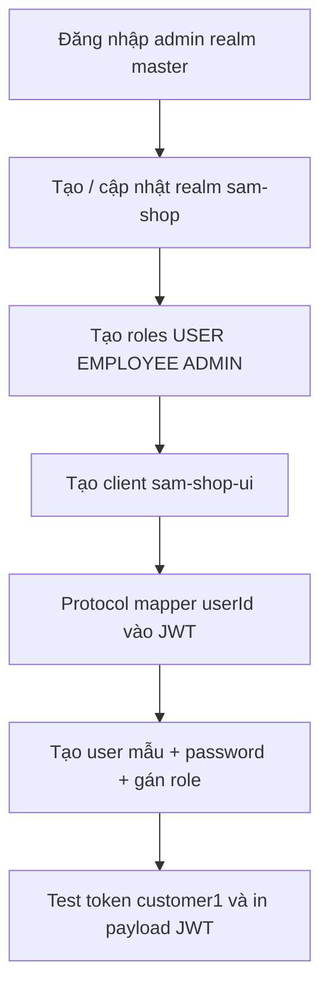

# Giải thích script `configure-sam-shop.ps1`

Tài liệu mô tả **công việc** script làm, **vấn đề** nó giải quyết, và **lý do** chọn từng cách cấu hình — để có thể chạy lại, sửa realm, hoặc tái tạo môi trường dev mà không phải thao tác thủ công trên Keycloak Admin Console.

**Script:** [`configure-sam-shop.ps1`](./configure-sam-shop.ps1)  
**Chạy khi:** Keycloak đã lên (`identity-service` / port `8180`), sau lần cài mới hoặc khi realm bị xóa/lệch cấu hình.

```powershell
docker compose up -d postgres-keycloak identity-service
powershell -ExecutionPolicy Bypass -File identity-service/keycloak/configure-sam-shop.ps1
```

---

## 1. Bối cảnh: vấn đề cần giải quyết

Sam Shop là hệ **microservices** (cart, order, payment, chat, …). Mỗi service cần:

| Nhu cầu | Vì sao không làm “mỗi service một DB user”? |
|---------|---------------------------------------------|
| **Xác thực tập trung** | Một nơi quản lý mật khẩu, khóa tài khoản, role |
| **JWT chuẩn OAuth2/OIDC** | Gateway và service dùng chung `issuer`, verify chữ ký qua JWK |
| **Phân quyền theo role** | `USER` / `EMPLOYEE` / `ADMIN` — Spring Security `hasRole(...)` |
| **Định danh nghiệp vụ `userId`** | Cart/order/payment lưu `userId` kiểu `long` (1, 2, 3…), **không** dùng UUID Keycloak (`sub`) |

Keycloak Admin Console có thể cấu hình tất cả, nhưng:

- Dễ sót bước (mapper `userId`, bật Direct Access Grants, …).
- Khó tái tạo giống nhau giữa máy dev / CI.
- Không version-control được “trạng thái mong muốn”.

**Cách chọn:** script **idempotent** (chạy nhiều lần an toàn) gọi **Keycloak Admin REST API**, mô tả realm `sam-shop` như code/infrastructure-as-script.

**Tại sao PowerShell:** team dev trên Windows; `Invoke-RestMethod` có sẵn, không cần cài thêm CLI. Có thể thay bằng `kcadm.sh` trong container nếu script lỗi JSON (xem [README.md](./README.md)).

---

## 2. Luồng tổng thể của script



---

## 3. Phần khởi tạo: biến môi trường & `Invoke-Kc`

### Công việc

```powershell
$KeycloakUrl = $env:KEYCLOAK_URL ?? 'http://localhost:8180'
$AdminUser / $AdminPassword  # KC_ADMIN_*
# Lấy access_token realm master (client admin-cli)
function Invoke-Kc { ... }  # wrapper GET/POST/PUT Admin API
```

### Giải quyết gì?

- Script gọi API dưới quyền **admin Keycloak** (realm `master`), không phải user `sam-shop`.
- Một hàm `Invoke-Kc` tránh lặp URL, header `Authorization`, serialize JSON.

### Tại sao chọn cách đó?

| Quyết định | Lý do |
|------------|--------|
| Token từ realm **`master`** | User admin bootstrap (`KC_BOOTSTRAP_ADMIN_*`) nằm ở master; Admin API `/admin/*` yêu cầu quyền này |
| Client **`admin-cli`** + `grant_type=password` | Cách chuẩn của Keycloak cho automation/script; không cần tạo service account riêng cho script setup |
| `KEYCLOAK_URL` override được | Docker map `8180:8080`; CI có thể trỏ URL khác |
| `-AsArray` khi gán role | Keycloak API `role-mappings/realm` nhận **mảng** JSON; PowerShell `ConvertTo-Json` một object đôi khi không ra array — flag này ép đúng format |

---

## 4. Bước 1 — Realm `sam-shop`

### Công việc

- Nếu realm **chưa có** → `POST /admin/realms` tạo `sam-shop`.
- Nếu **đã có** → `PUT` cập nhật một số cờ.

### Cấu hình quan trọng

| Thuộc tính | Giá trị | Ý nghĩa |
|------------|---------|---------|
| `registrationAllowed` | `false` | **Không** bật self-registration Keycloak mặc định |
| `loginWithEmailAllowed` | `true` | Có thể đăng nhập bằng email (tùy client) |
| `resetPasswordAllowed` | `true` | Cho phép reset mật khẩu qua flow Keycloak |
| `editUsernameAllowed` | `false` | Username cố định sau tạo — phù hợp hệ thống có `username` làm khóa đăng nhập |
| `sslRequired` | `external` | Dev HTTP localhost vẫn chạy; production HTTPS vẫn bắt buộc khi expose ra ngoài |

### Tại sao `registrationAllowed = false`?

Đăng ký công khai được xử lý bởi **`user-service`** (`POST /api/auth/register`): luôn gán role `USER`, tự set attribute `userId`, kiểm tra trùng username. Self-registration Keycloak khó kiểm soát role và `userId` đồng bộ với cart/order.

---

## 5. Bước 2 — Realm roles: `USER`, `EMPLOYEE`, `ADMIN`

### Công việc

Tạo (nếu thiếu) ba **realm role** cùng tên với role nghiệp vụ.

### Giải quyết gì?

- JWT chứa `realm_access.roles` → Spring map thành `ROLE_USER`, `ROLE_EMPLOYEE`, `ROLE_ADMIN`.
- Gateway / microservice: `.hasRole("ADMIN")`, `.hasAnyRole("EMPLOYEE", "ADMIN")`, v.v.

### Tại sao realm role (không client role)?

| Realm role | Client role |
|------------|-------------|
| Một token dùng cho **mọi** API qua Gateway | Gắn với từng client — phức tạp khi thêm service |
| Khớp mô hình “vai trò người dùng trong hệ thống” | Phù hợp khi nhiều app OAuth khác nhau |

Sam Shop có một SPA (`sam-shop-ui`) và một issuer → **realm role** đơn giản và đủ.

---

## 6. Bước 3 — Client `sam-shop-ui`

### Công việc

Tạo hoặc cập nhật OIDC client cho Angular frontend.

### Cấu hình chính

| Thuộc tính | Giá trị | Lý do |
|------------|---------|--------|
| `publicClient` | `true` | SPA không giữ **client secret** an toàn trên browser |
| `directAccessGrantsEnabled` | `true` | Cho phép **Resource Owner Password** — FE gọi `/token` với username/password (xem `auth.service.ts`) |
| `standardFlowEnabled` | `true` | Giữ khả năng redirect/OAuth code flow sau này |
| `redirectUris` | `http://localhost:4200/*` | Khớp dev server / Docker frontend |
| `webOrigins` | `http://localhost:4200`, `+` | CORS cho dev; `+` = origin theo redirect (tiện khi đổi port) |

### Tại sao bật Direct Access Grants (password grant)?

- Frontend hiện tại **tự gọi** `POST .../token` với `grant_type=password` — không redirect sang trang login Keycloak.
- Đơn giản cho demo/dev; đổi sang Authorization Code + PKCE khi production hardened.

**Lưu ý bảo mật:** Password grant không khuyến nghị cho production công khai; nên chuyển sang hosted login Keycloak hoặc BFF. Với môi trường học tập / nội bộ, trade-off được chấp nhận để giảm phức tạp UI.

---

## 7. Bước 4 — Protocol mapper `userId`

### Công việc

Thêm mapper `oidc-usermodel-attribute-mapper`:

- Đọc user attribute **`userId`** trên Keycloak.
- Ghi vào JWT claim **`userId`** (kiểu `long`).
- Có trong access token + id token + userinfo.

### Vấn đề nếu không có mapper

| Không có `userId` trong JWT | Hậu quả |
|-----------------------------|---------|
| Chỉ có `sub` (UUID Keycloak) | `cart-service` / `order-service` không khớp khóa `userId` trong DB |
| Mỗi service tự sinh ID | Trùng lặch, không thống nhất với dữ liệu cũ |

Microservices Sam Shop đã thiết kế **`userId` số nguyên** từ đầu (script gán `1`, `2`, `3` cho user mẫu; `user-service` tăng dần khi đăng ký mới).

### Tại sao user attribute thay vì hard-code trong mapper?

- Admin/`user-service` có thể **gán `userId` khi tạo user** mà không sửa realm.
- Mapper chỉ “xuất” attribute ra token — tách **lưu trữ** (Keycloak) và **phát hành** (JWT).

### Tại sao không dùng `sub` làm userId?

`sub` là UUID, đổi khi export/import realm; khó đọc và không khớp schema JPA `Long userId` đã có trong cart/order/chat.

---

## 8. Bước 5 — User mẫu & gán role

### Công việc

Với mỗi `customer1`, `staff1`, `admin1`:

1. Tạo user (hoặc cập nhật email, `enabled`, attributes).
2. `PUT .../reset-password` — mật khẩu `123456`, `temporary: false`.
3. `POST .../role-mappings/realm` — gán đúng role.

### Giải quyết gì?

- Dev/test E2E ngay không cần tạo tay trên Admin Console.
- Đảm bảo mỗi role có ít nhất một tài khoản để thử chat, admin, catalog.

### Tại sao idempotent (create hoặc update)?

Chạy lại script sau khi đổi email/`userId` attribute sẽ **đồng bộ** lại trạng thái mong muốn, không báo lỗi “user already exists”.

### Tại sao `emailVerified = true`?

Tránh **required action** “Verify Email” chặn login password grant — lỗi hay gặp khi setup Keycloak mới (“Invalid user credentials” dù đúng mật khẩu).

---

## 9. Bước 6 — Verify token (cuối script)

### Công việc

- Gọi token endpoint realm `sam-shop` với `customer1` / `123456`.
- Decode payload JWT (base64) và in ra console.

### Mục đích

Xác nhận nhanh:

- Client + user + password đúng.
- Claim **`userId`** và **`realm_access.roles`** có trong token.

Nếu thiếu `userId` → kiểm tra mapper hoặc attribute user trước khi debug microservice.

---

## 10. Mối quan hệ với các thành phần khác

```text
configure-sam-shop.ps1          user-service (runtime)
        |                                |
        v                                v
   Realm / Client / Mapper         Tạo user mới qua Admin API
   User mẫu 1,2,3                  userId = max + 1, role USER/...
        |                                |
        +──────────── JWT ───────────────+
                         |
              Gateway + microservices
              (issuer-uri, hasRole, claim userId)
```

| Thành phần | Script setup | Runtime |
|-------------|--------------|---------|
| Realm / roles / client | `configure-sam-shop.ps1` | — |
| User mẫu dev | Script | — |
| Đăng ký khách `/register` | Tắt `registrationAllowed` trên realm | `user-service` |
| Admin tạo staff | — | `/admin/users` + `user-service` |
| Mapper `userId` | Script tạo một lần | Mọi user cần attribute `userId` |

---

## 11. Idempotent & giới hạn

### Script làm tốt

- Tạo/cập nhật realm, roles, client, mapper, user mẫu.
- Chạy lại an toàn trên cùng Keycloak đang chạy.

### Script không làm

- Không xóa user thừa / role tùy ý (tránh mất dữ liệu dev).
- Không cấu hình `user-service` client (service account) — credentials admin dùng `admin-cli` master, giống script.
- Không thay đổi theme/login UI Keycloak.

### Khi nào cần sửa script?

- Đổi port frontend (4200 → khác) → sửa `redirectUris`, `webOrigins`.
- Thêm role mới (ví dụ `WAREHOUSE`) → thêm vào bước 2 + cập nhật SecurityConfig các service.
- Production tắt password grant → tắt `directAccessGrantsEnabled`, chuyển FE sang authorization code.

---

## 12. Biến môi trường

| Biến | Mặc định | Dùng cho |
|------|----------|----------|
| `KEYCLOAK_URL` | `http://localhost:8180` | Base URL Keycloak (host) |
| `KC_ADMIN_USERNAME` | `admin` | Admin master |
| `KC_ADMIN_PASSWORD` | `admin` | Khớp `KC_BOOTSTRAP_ADMIN_PASSWORD` trong compose |

---

## 13. Tóm tắt “tại sao chọn cách đó”

| Chủ đề | Lựa chọn | Lý do ngắn gọn |
|--------|----------|----------------|
| Công cụ setup | Script Admin REST | Tái tạo được, review được, không phụ thuộc click UI |
| Identity broker | Keycloak realm riêng `sam-shop` | Tách biệt master admin vs user ứng dụng |
| Role | Realm roles 3 tầng | Khớp nghiệp vụ + Spring Security |
| FE login | Public client + password grant | Đơn giản SPA hiện tại; đổi PKCE sau |
| ID nghiệp vụ | Attribute `userId` + mapper | Khớp DB microservices, không dùng UUID `sub` |
| Đăng ký | Tắt trên realm, bật qua API | Kiểm soát role và `userId` |
| User dev | Script seed 3 account | Test chat/admin/customer ngay |

---

*Xem thêm: [README.md](./README.md), [docs/YEU_CAU_VA_LOI_TRIEN_KHAI.md](../../docs/YEU_CAU_VA_LOI_TRIEN_KHAI.md).*
